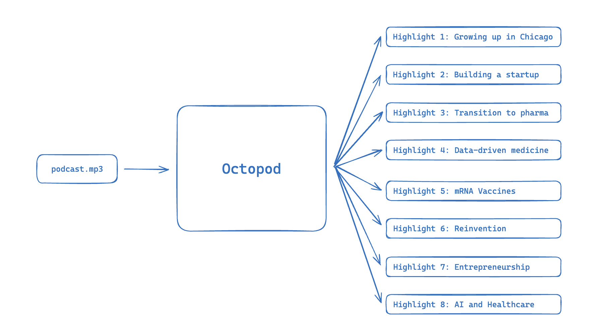

# octopod
Octopod automatically extracts highlights from podcast-like audio files.



## usage
The service can be launched using Docker Compose. The following command will build the Docker image and start the service on port 8000. Note that you need to provide an OpenAI API key as an environment variable.

```bash
OPENAI_API_KEY={OPENAI_API_KEY} docker compose up
````

You can submit a file to the API by sending a POST request to the `/api/v1/submit` endpoint. The file should be sent as a form-data field named `file`. The API will respond with a JSON object containing the submission ID.

```bash
$ curl -s http://70.228.65.239:18888/api/v1/submit \
    -F "file=@examples/big_ideas.mp3" \
    -F "title=Big ideas" \
    -F "description=Big ideas is a podcast about..."
{
    "id":"YOUR_SUBMISSION_ID",
    "status":"IN_QUEUE"
}
```

To check the status of the submission, send a GET request to the `/api/v1/submission/{YOUR_SUBMISSION_ID}` endpoint. The API will respond with a JSON object containing the highlights extracted from the audio file.

```bash
curl -s http://localhost:18888/api/v1/submission/{YOUR_SUBMISSION_ID}
{
    "id": "16c33562-8042-4a1b-a2db-16979580e8d0",
    "duration": 1847.9136507936507,
    "status": "COMPLETE",
    "progress": 1,
    "highlights": [
        {
            "id": "0d22abc7-727d-4555-9174-29a09fe2a5b0",
            "start_time": 28.760000228881836,
            "end_time": 135.0399932861328,
            "title": "Interest in Biology and Computational Drug Design",
            "description": "Kim Branson discussed his journey from initially being drawn to molecular biology and bacterial pathogenesis in university to discovering his passion for computational drug design. He highlighted the interplay between his childhood interest in computers, his love for math and physics, and the allure of structural biology. Kim also shared insights into the development of computational methods for drug design and the success of the neuraminidase drug Relenza, which was designed using computational techniques.",
        },
        ...
    ]
}
```

The status field will transition from `IN_QUEUE` to `TRANSCRIBE` to `ANALYZE` to `COMPLETE` as the service processes the submission; the progress field reflects the progress of the current stage. Finally, for each highlight in the response, the corresponding audio file can be fetched from the `/api/v1/highlight/{HIGHLIGHT_ID}` endpoint.

A minimal web interface is available at [http://localhost:18888/](http://localhost:18888/) to view recent submissions and highlights.
